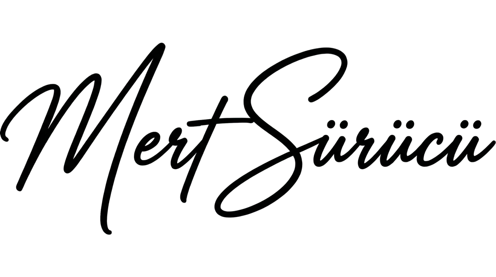

  
  <h1>Mert Sürücü · Kişisel AI Asistanı</h1>
  
Mert Sürücü hakkında doğrulanmış bilgiler sunan Türkçe ve İngilizce kişisel asistan.

  
<a href="https://mertsurucu.com"><strong>Canlı siteyi aç ↗</strong></a>

  

  Ziyaretçilerin Mert’in eğitimi, deneyimleri, projeleri, teknik becerileri ve
  iletişim bilgileri hakkında doğrudan bilgi alabilmesi için geliştirilmiştir.

  <samp>━━━━━━━━━━━━━━━━━━━━━━━━━━</samp>
  <h3>Aktif sitenin yapabildikleri</h3>
  <samp>━━━━━━━━━━━━━━━━━━━━━━━━━━</samp>

  Türkçe ve İngilizce yanıtlar 
  Kelime, ifade ve doğal soru eşleştirmesi 
  Kontrollü yazım hatası düzeltme 
  Doğrulanmış bilgi tabanına bağlı cevaplar 
  Mobil ve masaüstü uyumlu arayüz 
  Güvenli bağlantılar ve otomatik kontroller

  İçerikler <a href="./data/knowledge.json"><strong>knowledge.json</strong></a>
  üzerinden düzenlenir. Asistan bilinmeyen konularda cevap üretmez.

  <samp>━━━━━━━━━━━━━━━━━━━━━━━</samp>
  <h3>Sonraki aşama hedefleri</h3>
  <samp>━━━━━━━━━━━━━━━━━━━━━━━</samp>

  Anlamsal arama ve daha güçlü niyet eşleştirmesi 
  Doğrulanmış kişisel kaynaklarla çalışan RAG sistemi 
  Yeni kaynakların kolayca eklenebildiği ölçeklenebilir bilgi yapısı 
  Yanıt kalitesini ölçen genişletilmiş değerlendirme sistemi

  Üçüncü taraf varlıkların lisansları <a href="./THIRD_PARTY_NOTICES.md">THIRD_PARTY_NOTICES.md</a> dosyasındadır.

  <picture>
    <source media="(prefers-color-scheme: dark)" srcset="./public/assets/signature-white.png">
    <source media="(prefers-color-scheme: light)" srcset="./public/assets/signature.png">
    
  </picture>

