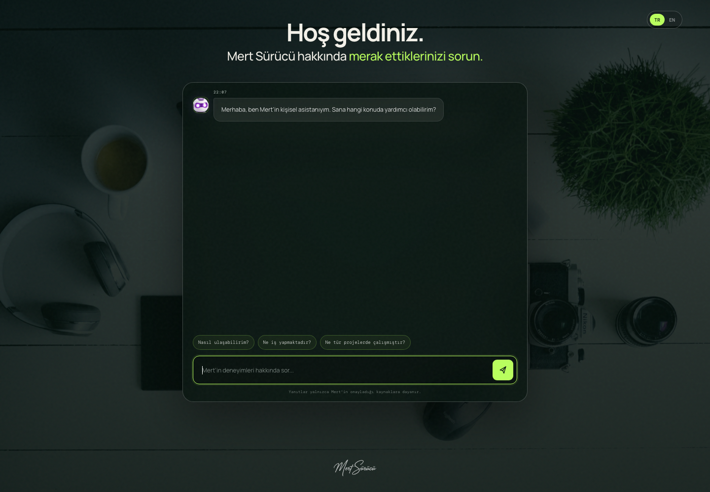

# Mert Sürücü — Kişisel AI Asistanı

<p align="center">
  <a href="https://mertsurucu.com">
    
  </a>
</p>

<p align="center">
  Mert Sürücü hakkında doğrulanmış bilgiler sunan, Türkçe ve İngilizce çalışan kişisel chatbot.
</p>

<p align="center">
  <a href="https://mertsurucu.com"><strong>Canlı siteyi aç</strong></a>
</p>

## Proje hakkında

Bu proje, ziyaretçilerin Mert’in eğitimi, deneyimleri, teknik becerileri,
projeleri ve iletişim bilgileri hakkında soru sorabilmesini sağlar.

Asistan cevap üretmez veya tahminde bulunmaz. Yalnızca kontrol edilmiş
[`data/qa.json`](data/qa.json) dosyasındaki bilgileri kullanır.

## Özellikler

- 33 doğrulanmış cevap ve 292 alternatif Türkçe soru
- Türkçe ve temel İngilizce desteği
- Yazım hatalarını ve kısa ifadeleri anlayan otomatik düzeltme
- Anlamsız veya bilinmeyen sorularda güvenli geri dönüş
- Tıklanabilir e-posta, LinkedIn, GitHub ve web bağlantıları
- Mobil ve masaüstü uyumlu tek ekran tasarımı
- API, framework veya harici paket gerektirmeyen statik yapı

## Nasıl çalışır?

1. Uygulama açıldığında `data/qa.json` yüklenir.
2. Kullanıcının sorusu Türkçe veya İngilizce olarak normalize edilir.
3. Eksik ve karışmış harfler yalnızca güvenilir bir eşleşme varsa düzeltilir.
4. En uygun onaylanmış cevap bulunarak sohbet ekranında gösterilir.
5. Güvenilir cevap bulunamazsa asistan bilgi uydurmaz.

Örnek düzeltmeler:

```text
sn kimsin                         → sen kimsin
satarnc oynuyormu                 → satranç oynuyor mu
wht ds mert do                    → what does mert do
wht projcts has mert workd on     → what projects has mert worked on
python banana                     → bilgi bulunamadı
```

## Yerelde çalıştırma

Herhangi bir kurulum veya paket yükleme gerekmez:

```bash
python3 -m http.server 8080
```

Ardından tarayıcıdan [http://localhost:8080](http://localhost:8080) adresini açın.

> `qa.json` tarayıcıda `fetch()` ile yüklendiği için `index.html` dosyasını
> doğrudan çift tıklamak yerine yerel sunucu kullanılmalıdır.

## Bilgi bankasını güncelleme

Tüm Türkçe sorular ve cevaplar [`data/qa.json`](data/qa.json) dosyasındadır.
Yeni bir kayıt şu yapıda eklenebilir:

```json
{
  "question": "Örnek soru nedir?",
  "alternatives": [
    "Bu soru başka nasıl sorulabilir?",
    "Kısa soru biçimi"
  ],
  "answer": "Doğrulanmış cevap buraya yazılır.",
  "category": "Örnek kategori"
}
```

Dosyayı kaydedip sayfayı yenilemek yeterlidir. Build işlemi gerekmez.

## Dosya yapısı

```text
├── data/qa.json              # Chatbot bilgi bankası
├── public/assets/            # Banner, imza ve asistan animasyonları
├── app.js                    # Chatbot ve otomatik düzeltme sistemi
├── index.html                # Sayfa yapısı
├── styles.css                # Responsive tasarım
└── CNAME                     # mertsurucu.com alan adı
```

## GitHub Pages

Depoyu GitHub’a gönderdikten sonra:

1. **Settings → Pages** bölümünü açın.
2. Ana branch’in kök dizinini yayın kaynağı olarak seçin.
3. GitHub’ın oluşturduğu HTTPS adresini açın.

`CNAME` dosyası özel alan adı olarak `mertsurucu.com` kullanılması için hazırdır.

## Gizlilik

- Projede `.env`, API anahtarı veya gizli erişim bilgisi kullanılmaz.
- Telefon numarası ve özel belgeler repoda bulunmaz.
- Bilgi bankası statik sitenin parçasıdır ve herkese açıktır.
- Kullanılan asistan animasyonlarının lisans bilgisi
  [`THIRD_PARTY_NOTICES.md`](THIRD_PARTY_NOTICES.md) dosyasındadır.

## Geliştirme durumu

Projenin geliştirme çalışmaları devam etmektedir. İlerleyen sürümlerde mevcut
statik soru-cevap sistemi; açık kaynak bir yapay zekâ modeli, anlamsal arama ve
doğrulanmış kişisel bilgi kaynaklarını birlikte kullanan gerçek bir RAG
(`Retrieval-Augmented Generation`) sistemine dönüştürülecektir.
# mertsurucu
